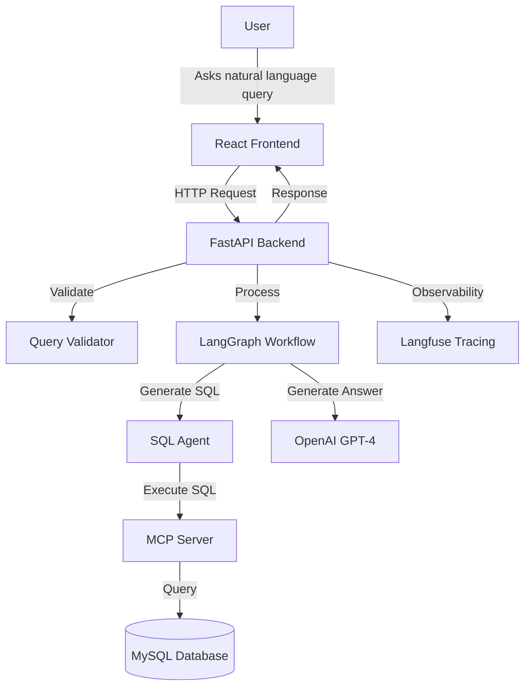

# DataChat Project Analysis

This document provides a comprehensive analysis of the DataChat project, including its architecture, components, libraries, and potential improvements.

## 1. Project Overview

DataChat is an application that enables users to query a database using natural language. It leverages AI to translate natural language questions into SQL queries, execute them against a database, and provide human-readable answers.

## 2. Architecture

The project follows a modern architecture with separate frontend and backend components:

### 2.1 Key Components

1. **Frontend**: React-based web interface (currently using default React template)
2. **Backend API**: FastAPI application handling HTTP requests and responses
3. **Workflow Engine**: LangGraph for orchestrating the query processing flow
4. **SQL Agent**: Converts natural language to SQL using LangChain and OpenAI
5. **MCP Server**: Interface layer to the MySQL database
6. **Guardrails**: Validates input to prevent SQL injection and other security issues
7. **Observability**: Traces execution with Langfuse and OpenTelemetry

### 2.2 Data Flow

1. User submits a natural language query via the frontend
2. Backend validates the query using Guardrails
3. The validated query is processed by the LangGraph workflow
4. SQL Agent generates SQL based on the query and database schema
5. MCP Server executes the SQL against the MySQL database
6. Results are validated, formatted into a natural language answer
7. The answer is returned to the user through the API and displayed in the frontend
8. All steps are traced for observability using Langfuse

## 3. Component Analysis

### 3.1 Backend Components

#### 3.1.1 FastAPI Backend (`backend/main.py`)

The backend is built using FastAPI, a modern, high-performance web framework for building APIs with Python. Key features include:

- **API Endpoints**:
  - `GET /`: Simple root endpoint returning a welcome message
  - `GET /health`: Health check endpoint
  - `POST /query`: Main endpoint for processing natural language queries
  - `GET /schema`: Returns database schema from the MCP server

- **CORS Configuration**: Configured to allow requests from the frontend (`http://localhost:3000`)

- **Request/Response Models**:
  - `QueryRequest`: Pydantic model for incoming query requests
  - `QueryResponse`: Pydantic model for query responses with fields for success status, answer, error, and trace ID

- **Error Handling**: Comprehensive try-except blocks with logging for both HTTP exceptions and general errors

- **Flow**:
  1. Query validation through guardrails
  2. Processing through the agent workflow
  3. Structured response back to the client

#### 3.1.2 Middleware and Integration

The application includes integration with:

- Logging: Standard Python logging
- CORS middleware: For frontend-backend communication
- Input validation: Via the guardrails_validators module

### 3.2 Workflow and Agents Implementation

#### 3.2.1 LangGraph Workflow (`backend/graph/workflow.py`)

The project uses LangGraph, a library for building stateful workflow applications with LLMs. Key features:

- **State Management**: Uses a `StateGraph` with a `TypedDict` called `AgentState` to track:
  - Original query
  - SQL execution results
  - Validation results
  - Final answer
  - Errors

- **Node Structure**:
  - `sql_node`: Interacts with the SQL agent to convert natural language to SQL and execute it
  - `validation_node`: Validates SQL execution results
  - `answer_node`: Generates natural language answers from SQL results using ChatOpenAI (GPT-4)
  - `should_continue`: Conditional router that decides the next step based on validation results

- **Flow Control**:
  - Workflow follows a directed graph pattern with conditional branching
  - Compilation of the graph enables efficient execution
  - Integration with Langfuse for tracing and observability

#### 3.2.2 SQL Agent (`backend/agents/sql_agent.py`)

The SQL Agent handles natural language to SQL conversion:

- **Tools**:
  - `get_schema`: Retrieves database schema from MCP server
  - `execute_sql`: Executes SQL queries via MCP server

- **Agent Creation**:
  - Uses LangChain to create an agent with a system prompt that enforces best practices
  - Model: GPT-4 with temperature=0 for deterministic outputs
  - Built using LangChain's agent framework with tool integration

- **Execution Flow**:
  1. Agent first gets the database schema
  2. Generates SQL based on the natural language query
  3. Executes the SQL
  4. Returns the results in a structured format

### 3.3 Database Connectivity and MCP Server (`backend/mcp_server.py`)

The MCP (Mission Control Panel) Server provides a layer of abstraction for database operations:

- **Database Connection**: Uses mysql-connector-python to connect to a MySQL database with credentials from environment variables

- **Key Functionality**:
  - `execute_query`: Executes SQL queries and handles different query types (SELECT vs. DML)
  - `get_schema`: Retrieves database schema information (tables structure and relationships)
- **Error Handling**: Comprehensive try-except blocks to handle database connection and query execution errors

- **Implementation Pattern**: Singleton instance created at module level for reuse across the application

### 3.4 Guardrails and Security (`backend/guardrails_validators.py`)

The project implements query validation and security measures:

- **Pydantic Model**: `QueryRequest` with built-in validation

- **SQL Injection Prevention**:
  - Regex-based pattern matching to detect potentially malicious SQL patterns
  - Blocks common attack vectors like DROP, DELETE, UNION, comment syntax, etc.

- **Validation Flow**:
  - Validates query structure
  - Checks for malicious patterns
  - Returns structured validation result

- **Alternative Implementation**: Simple function-based validator provided as a lightweight option

### 3.5 Observability and Tracing (`backend/observability/tracing.py`)

The project implements comprehensive observability:

- **Langfuse Integration**:
  - Integration with Langfuse for tracing LLM interactions
  - Uses decorators (`@observe`) to automatically trace function calls

- **OpenTelemetry**:
  - Additional attribute tagging for detailed tracing
  - Provides context propagation between components

- **Context Management**:
  - Uses `propagate_attributes` to ensure consistent context across the execution
  - Captures user IDs, tags, and other metadata

- **LangGraph Callback**:
  - Automatically traces workflow execution
  - Provides insights into each step of the process

### 3.6 Frontend

Currently, the frontend appears to be using the default React template with no custom implementation for the DataChat application. The standard React boilerplate includes:

- Basic page layout with React logo
- Default styling
- No custom components for chat interface or query input/output

### 3.7 Libraries and Dependencies

The project leverages a comprehensive set of modern libraries:

#### 3.7.1 Core Framework Libraries

- **FastAPI (0.135.1)**: Modern, high-performance web framework for building APIs
- **Uvicorn (0.41.0)**: ASGI server for running FastAPI applications
- **Starlette (0.52.1)**: Lightweight ASGI framework/toolkit used by FastAPI

#### 3.7.2 Database Libraries

- **MySQL Connector Python (9.6.0)**: Official MySQL client library for Python

#### 3.7.3 AI and LLM Libraries

- **LangChain (1.2.12)**: Framework for developing applications with LLMs
- **LangChain-OpenAI (1.1.11)**: OpenAI integration for LangChain
- **LangGraph (1.1.1)**: Library for building stateful workflow applications with LLMs
- **OpenAI (2.26.0)**: Client library for accessing OpenAI models
- **LiteLLM (1.82.1)**: Library for standardized interface to different LLM providers

#### 3.7.4 Guardrails and Validation

- **Guardrails-ai (0.9.1)**: Library for adding guardrails to LLM outputs
- **Pydantic (2.12.5)**: Data validation and settings management library
- **JSONSchema (4.26.0)**: JSON Schema validation tools

#### 3.7.5 Observability and Tracing

- **Langfuse (4.0.0)**: LLM observability platform
- **OpenTelemetry (1.40.0)**: Observability framework (metrics, tracing, and logs)
- **OpenTelemetry SDK (1.40.0)**: SDK for implementing OpenTelemetry

#### 3.7.6 Utility Libraries

- **Python-dotenv (1.2.0)**: Loading environment variables from .env files
- **Typer (0.19.2)**: CLI library built on top of Click
- **Rich (14.3.3)**: Library for rich text and formatting in the terminal
- **Tenacity (9.1.4)**: Retry library with flexibility
- **HTTPX (0.28.1)**: Modern HTTP client with async support

#### 3.7.7 Data Processing Libraries

- **PyYAML (6.0.3)**: YAML parser and emitter
- **LXML (6.0.2)**: XML processing library
- **Orjson (3.11.7)**: Fast, correct JSON library

## 4. Potential Improvements

### 4.1 Architecture and Design Improvements

1. **Frontend Implementation**: The frontend appears to be using the default React template. A custom frontend implementation with:
   - Chat interface for query input
   - Display for query results
   - History of previous queries
   - Database schema visualization
   - Would enhance the user experience significantly.

2. **Comprehensive Error Handling**: While the backend has error handling, a more detailed error taxonomy and user-friendly error messages would improve the user experience.

3. **Authentication and Authorization**: The current implementation lacks user authentication and authorization, which would be essential for a production deployment.

### 4.2 Technical Improvements

1. **Type Mismatch Bug Fix**: There's a critical type mismatch in the workflow implementation:
   - In `AgentState`, `sql_result` is defined as `Annotated[dict, operator.add]`
   - But in `trace_agent_run`, it's initialized as a list: `'sql_result':[]`
   - This causes the error: `TypeError: unsupported operand type(s) for +: 'dict' and 'list'`
   - Fix: Change initialization to match the type definition (either make both dict or both list)

2. **SQL Agent Enhancement**:
   - Implement feedback loop for failed SQL queries
   - Add support for more complex SQL operations
   - Improve query optimization capabilities

3. **Testing**: No test files were identified in the codebase. Adding:
   - Unit tests for components
   - Integration tests for the workflow
   - End-to-end tests for the full application
   - Would significantly improve reliability and maintainability.

4. **Caching Layer**: Implementing a caching mechanism for frequently run queries would improve performance.

5. **Database Connection Pooling**: Using connection pooling rather than creating new connections for each request would enhance performance.

6. **Comprehensive Logging**: While basic logging is implemented, a more structured logging approach with different log levels and contextual information would aid debugging.

### 4.3 Deployment and DevOps

1. **Containerization**: Adding Docker configuration for consistent deployment environments.

2. **CI/CD Pipeline**: Implementing automated testing and deployment workflows.

3. **Environment Configuration**: More robust environment variable handling with validation.

4. **Monitoring and Alerting**: Adding integrated monitoring for both application and database performance.

## 5. Conclusion

The DataChat project is a well-structured application that effectively leverages modern AI techniques to enable natural language querying of databases. The architecture follows good practices with clear separation of concerns, modular components, and comprehensive error handling.

The use of LangGraph for workflow management and LangChain for agent implementation provides a strong foundation for the NL-to-SQL functionality. The integration with Langfuse for observability demonstrates a focus on maintainability and debuggability.

While there are areas for improvement, particularly in the frontend implementation and testing coverage, the overall design is solid and follows modern best practices for AI-enabled applications.

## 4. Potential Improvements

Areas of potential improvement will be identified...
