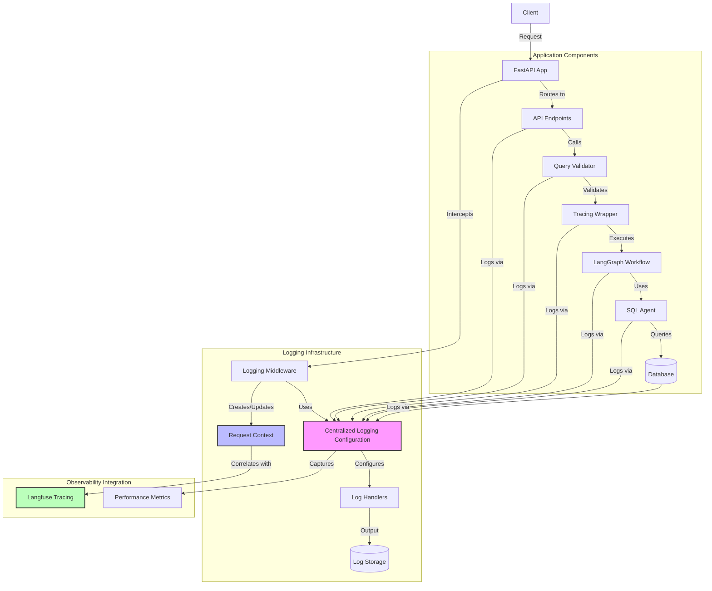
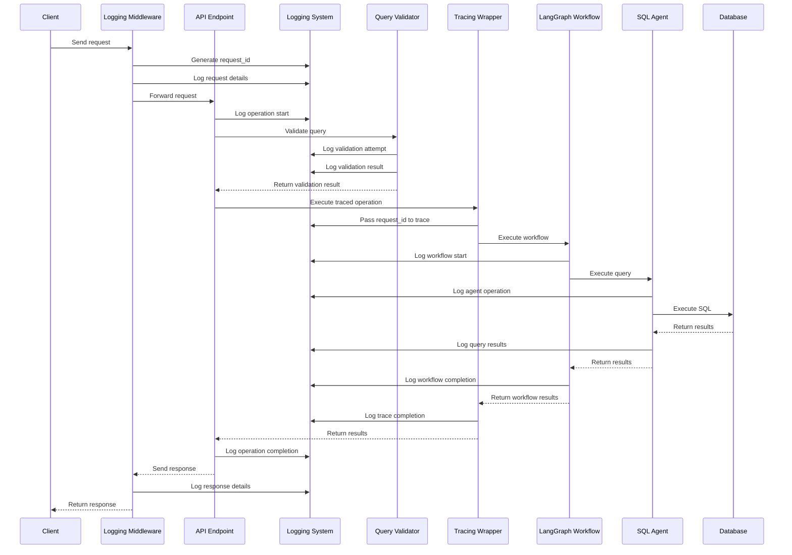
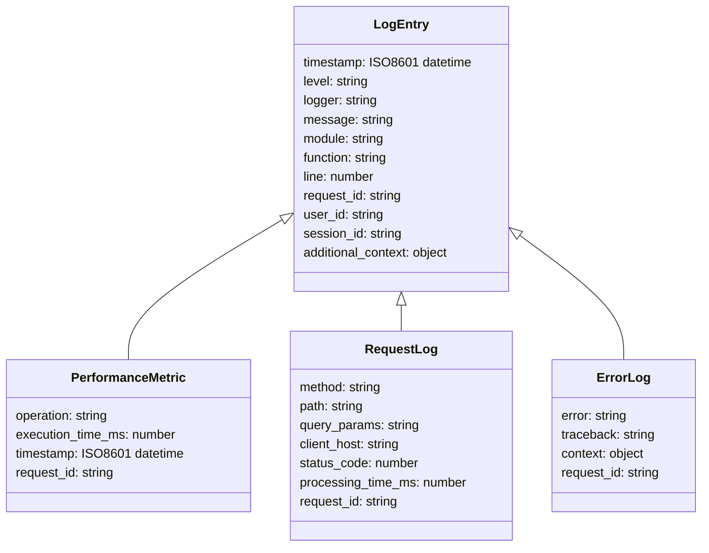
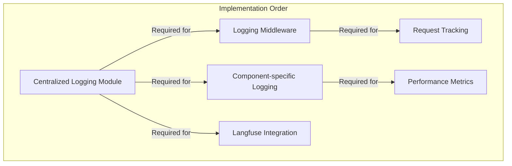

# DataChat Logging Architecture

## Components and Flow



## Request Flow with Logging



## Log Data Structure



## Implementation Dependencies



## Directory Structure

```
backend/
├── observability/
│   ├── __init__.py
│   ├── logging.py     (new)
│   └── tracing.py     (updated)
├── middleware/
│   ├── __init__.py    (new)
│   └── logging_middleware.py (new)
├── logs/              (new directory)
├── main.py            (updated)
├── agents/
│   └── sql_agent.py   (updated)
├── graph/
│   └── workflow.py    (updated)
└── guardrails_validators.py (updated)
```
